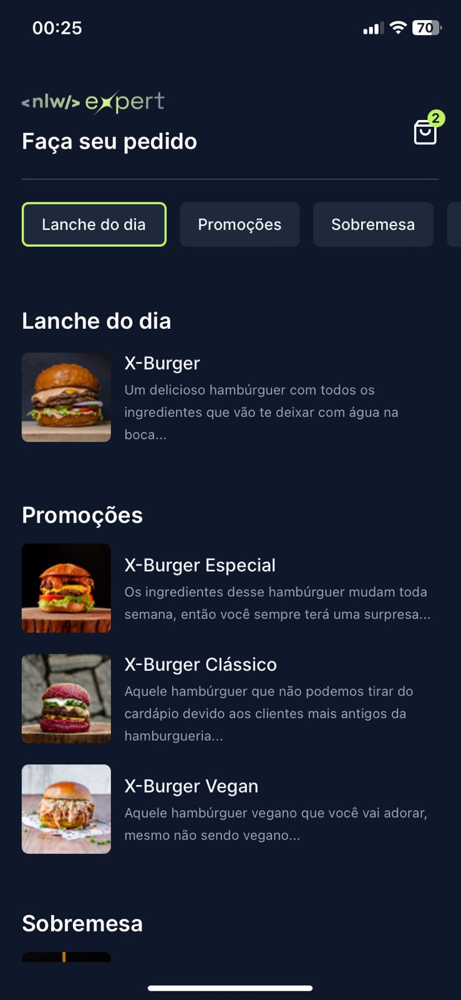
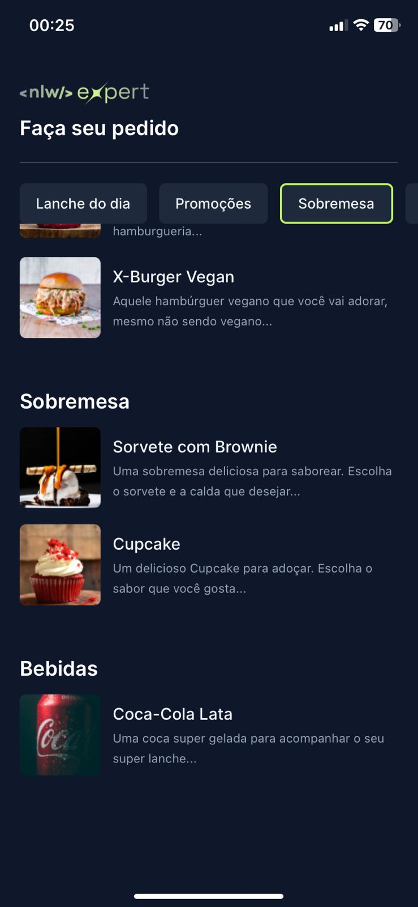
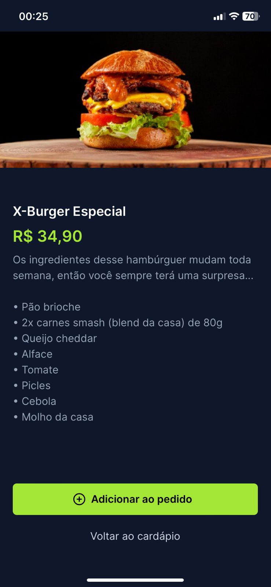
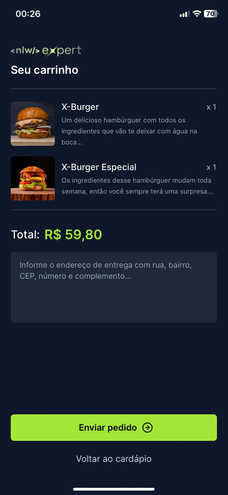
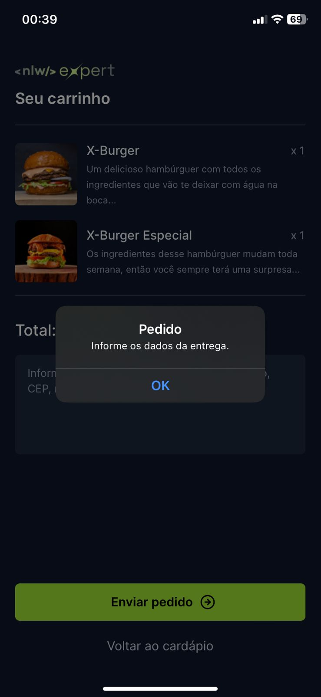
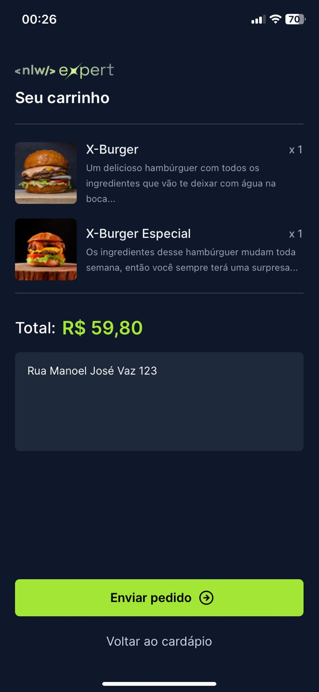

## Sobre ✔️

Aplicativo de lanches feito em React Native acompanhando o intensivo NLW Expert da Rocketseat.
 
 
<a href="https://www.figma.com/file/IeAVpk7DLwMvlZmxKxIQlb/NLW-expert-%E2%80%A2-Orders-(Community)?type=design&node-id=116-350&mode=design&t=oU9wynXVCky89lfM-0" target="_blank">Clique aqui para acessar o Figma Web</a>

---

## Tecnologias Utilizadas 📎

Esse projeto foi desenvolvido com as seguintes tecnologias:

- [React Native](https://reactnative.dev/)
- [TypeScript](https://www.typescriptlang.org/docs/)
- [Tailwind Css](https://tailwindcss.com/docs/installation)
- [Expo](https://expo.dev/)
- [Zustand](https://zustand-demo.pmnd.rs/)

---

## Pré-requisitos 📝

Para rodar este projeto é necessário ter instalado na sua máquina as seguintes tecnologias:

- É necessário possuir o [Node.js](https://nodejs.org/en/) instalado na máquina.
- Também, é preciso ter um gerenciador de pacotes seja [Yarn](https://yarnpkg.com/) ou [Npm](https://www.npmjs.com/).
- Nesse projeto utilizei o [Expo](https://expo.dev/).

## Para rodar o projeto 📌

No terminal rode: `npx expo start`

ou se preferir:

1. Escolher o emulador da sua preferência.
2. Instale as dependências: `npm install`
3. Startar a aplicação: `npm run dev`

## Resultado 📷

<h1 align="center">
    
    
    
    
    
    
    
    
</h1>
